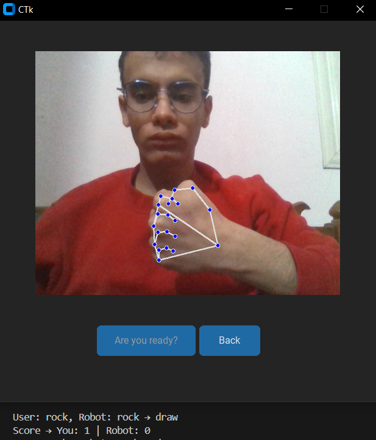

# 🧠 Computer Vision & AI Reasoning Engine

This module represents the "Frontal Lobe" of Jarvis, where raw visual data from the webcam is transformed into intelligent robotic behavior. Using **MediaPipe** and **OpenCV**, Jarvis can recognize gestures, track human movement, and make autonomous decisions.

---

## ✊✋✌️ 1. Autonomous Rock-Paper-Scissors Logic

In this mode, Jarvis isn't just following commands; he is perceiving and reacting. The system uses a specialized hand-tracking model to analyze the user's move.

### 📸 Visual Recognition (The "How-To")
|  |  |  |
| :---: | :---: | :---: |
| **Detected: ROCK** | **Detected: PAPER** | **Detected: SCISSORS** |

### 🔍 Deep Dive into the Logic (`gameplay.py`):
Jarvis identifies **21 hand landmarks**. The gesture is classified based on the spatial relationship between the **Tips** and **Pip joints** of each finger.

1.  **Coordinate Analysis:** The software monitors the Y-coordinate of landmarks `8, 12, 16, 20`. 
2.  **The Algorithm:**
    * **Paper:** All four monitored tips are *above* (numerically lower than) their base joints.
    * **Rock:** All finger tips are *below* their base joints (fist closed).
    * **Scissors:** Only the Index (`8`) and Middle (`12`) tips are above their joints.
3.  **Autonomous Response:** Once the user's hand is classified, Jarvis uses the `random` library to pick his move and executes a pre-recorded animation profile to move the physical arm accordingly.

---

## 🎯 2. Real-Time Vision Tracking (Face-to-Base Center)

This feature creates the illusion of "life" by allowing Jarvis to follow the user around the room.

*(Image: Real-time pose estimation showing Jarvis locking onto the user's center)*

### 👃 The "Nose-Lock" Strategy
Instead of tracking the entire hand or body (which can be erratic), Jarvis focuses on the **PoseLandmark.NOSE**. This point is the most stable and provides a perfect "center" for social interaction.

### 📐 Mathematical Coordinate Mapping
The core of the tracking logic is the transformation of a 2D camera pixel into a 1D servo degree. 

**The Transformation Formula:**
`mapped_angle = int((nose_pixel_x / frame_width) * (155 - 65) + 65)`

**Explanation of the Math:**
* **Frame Width (500px):** The camera's horizontal resolution.
* **Safe Range (65° to 155°):** The physical limit of the robot's base servo to prevent mechanical collision or wire tangling.
* **Linear Scaling:** If the user is at pixel `0` (far left), the robot turns to `65°`. If at pixel `500` (far right), it turns to `155°`.

---

## ⚡ Technical Optimization & Stability

To ensure the robot moves smoothly without "jittering" (mechanical noise), I implemented the following:

* **Daemon Threading:** The vision engine runs on a dedicated background thread. This ensures the GUI stays at 60FPS while the AI is processing heavy frames.
* **Mirror Mode:** Using `cv2.flip(frame, 1)`, the camera feed is mirrored so that when you move left, Jarvis moves to his left, making the interaction intuitive.
* **Landmark Confidence:** The system only executes a move if MediaPipe returns a confidence score above **0.7**, preventing "ghost movements" in low-light conditions.

---

### 👨‍💻 Developed by:
**Ahmed Fayez** *Robotics & AI Systems Developer*
