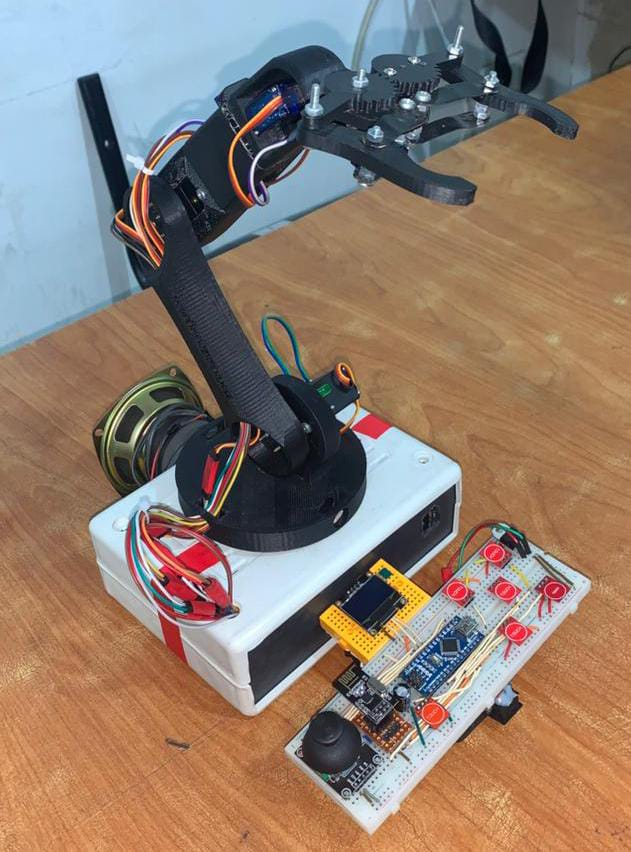

# 🦾 Jarvis: Interactive AI Robotic Arm Showcase

  

## 🌟 Introduction
**Jarvis** is a highly interactive, 6-DOF (Degrees of Freedom) social robotic arm system featuring a mobile base. Designed for high-level **Human-Robot Interaction (HRI)**, this project bridges the gap between mechanical precision and artificial intelligence. 

It was proudly showcased at a major tech conference, where it autonomously played "Rock-Paper-Scissors" with attendees, tracked their movements, and engaged with them through voice and fluid animations.

*Note: Due to the proprietary nature of the algorithms, desktop control suite, and hardware schematics, the source code is closed-source. This repository serves as a comprehensive technical portfolio demonstrating the system's architecture and capabilities.*

---

## 🚀 Core Capabilities

1. **🧠 AI & Computer Vision:** Real-time gesture recognition (MediaPipe & OpenCV) for playing Rock-Paper-Scissors autonomously.
2. **🎯 Dynamic Target Tracking:** Mathematical mapping algorithms that allow the robot to maintain "social presence" by tracking facial landmarks and centering its base.
3. **🎮 Wireless Control Ecosystem:** A custom-built NRF24L01 remote with an OLED display and capacitive touch sensors for lag-free, multi-axis hardware override.
4. **🎬 Cinematic Motion Engine:** A custom Python-based Animation Recorder using Linear Interpolation smoothing to execute human-like, non-jittery gestures (e.g., handshakes, celebratory dances).
5. **🔊 Voice Integration:** Synchronized MP3 module that gives Jarvis a distinct personality, allowing it to introduce itself and react to game outcomes.

---

## 📂 Repository Navigation

Explore the technical depth of each module by visiting the specialized directories:

* 📁 **[1. System Architecture](./System-Architecture/Architecture.md):** High-level data flow, hardware integration, and details of the dual-microcontroller setup (Arduino Mega & Nano).
* 📁 **[2. Software Demonstration](./Software-Demonstration/README.md):** Inside the multi-threaded Python Dashboard, featuring the Animation Recorder, GUI screenshots, and PyFirmata2 integration.
* 📁 **[3. Computer Vision Logic](./Computer-Vision-Logic/README.md):** Deep dive into the AI reasoning engine, covering the "Fingers Up" algorithm, visual tracking mapping, and logic optimization.
* 🎞️ **[4. Media Gallery](./Media/Media-Gallery.md):** Video proofs, conference exhibition photos, and live demonstrations of Jarvis in action.

---

## 🛠️ Technology Stack

| Category | Technologies Used |
| :--- | :--- |
| **Artificial Intelligence** | Python, OpenCV, MediaPipe (Hand & Pose Landmarks) |
| **Control Software** | CustomTkinter (GUI), PyFirmata2, Multi-threading |
| **Embedded Systems** | C++, Arduino Mega 2560, Arduino Nano |
| **Communication** | NRF24L01 (2.4GHz Wireless), Serial Communication |
| **Actuation & Hardware** | 6x High-Torque Servos, Serial MP3 Module, OLED Display |

---
### 👨‍💻 Developed by:
**Ahmed Fayez** *Robotics, AI & Embedded Systems Developer*
