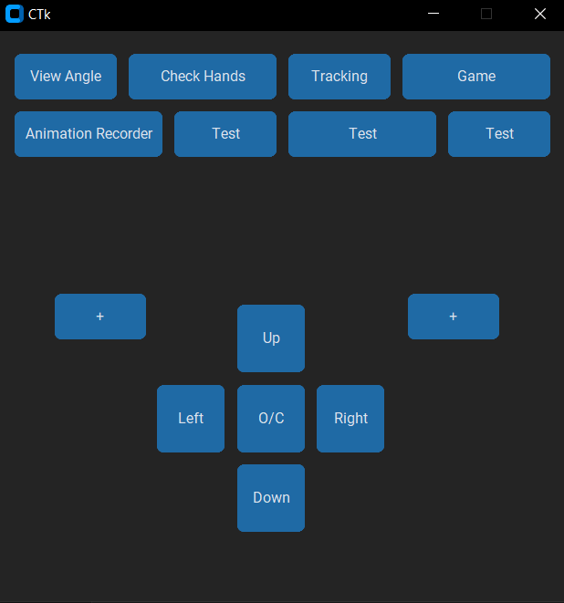
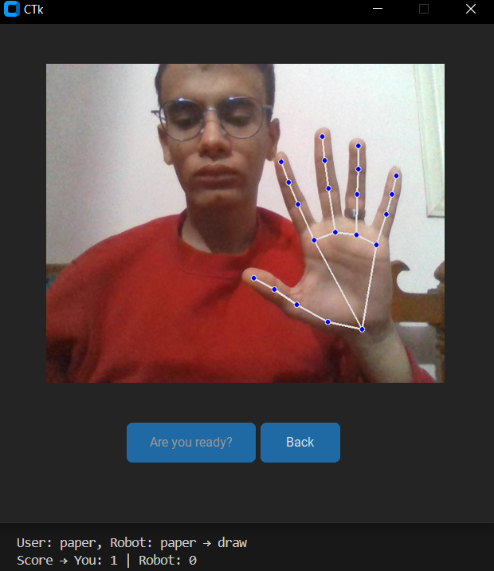
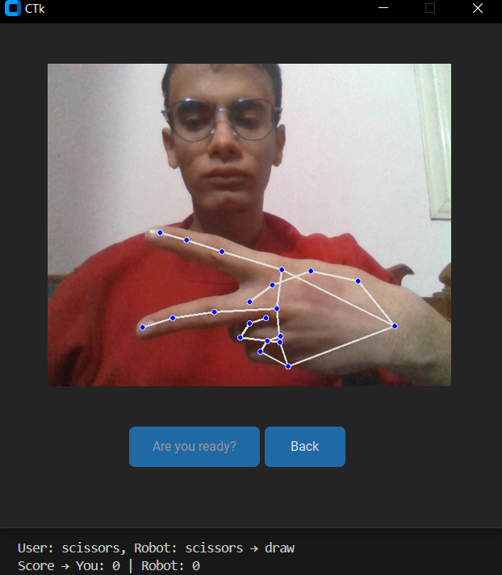
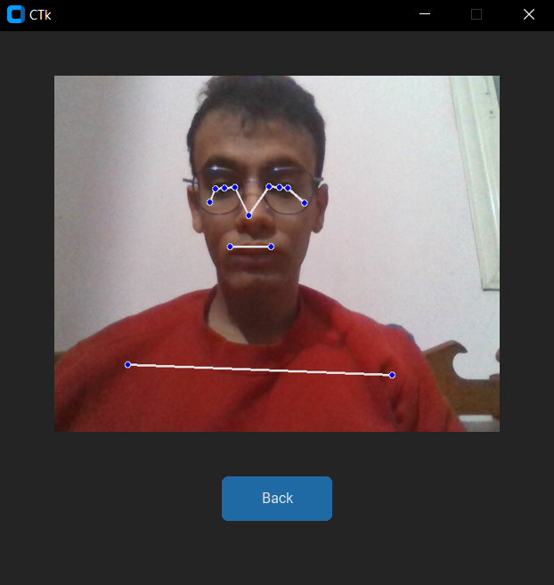

# 🖥️ Software Ecosystem & AI Logic

This folder demonstrates the "Brain" of Jarvis—a sophisticated Python-based suite designed for real-time robotic control, computer vision, and motion recording. 

## 📊 1. Professional Dashboard (UI/UX)
The control center is built using **CustomTkinter**, providing a modern, high-performance interface to interact with the hardware.

**Key Dashboard Features:**
* **Real-time Angle Sync:** Bi-directional communication with Arduino Mega to monitor servo positions.
* **Motion Recorder:** A dedicated module to record manual movements and play them back with mathematical smoothing.
* **Multi-Threaded Execution:** The UI runs on a separate thread from the AI logic to ensure zero latency during operations.

---

## ✊✋✌️ 2. AI Game Logic: Rock Paper Scissors
Jarvis uses a custom-trained logic based on **MediaPipe Hands** to compete against humans.

| Rock | Paper | Scissors |
| :---: | :---: | :---: |
|  |  |  |

**How it works (The Engineering behind it):**
1. **Frame Capture:** OpenCV captures the camera feed.
2. **Landmark Detection:** The software identifies 21 hand-keypoints.
3. **Gesture Classification:** An algorithm calculates the relative distance between finger tips and joints to classify the gesture (e.g., if all fingers are extended = Paper).
4. **Decision Engine:** Jarvis generates a random move, compares it with the detected user move, and triggers the corresponding "Winner" or "Loser" animation and voice line.

---

## 🎯 3. Autonomous Vision Tracking
The tracking system allows Jarvis to maintain "eye contact" or follow a target dynamically.

**Technical Implementation:**
* **Targeting:** Uses the `PoseLandmark.NOSE` coordinate as the primary target.
* **Coordinate Mapping:** The software maps the X-coordinate of the target from the camera's resolution (e.g., 0-640) to the Servo's degree range (65°-155°).
* **PID-like Smoothing:** Movement is dampened in the software to prevent abrupt mechanical shaking.

---
### 🛠️ Core Libraries Used:
* `OpenCV`: Image processing.
* `MediaPipe`: AI Landmark detection.
* `CustomTkinter`: Modern GUI development.
* `PyFirmata2`: Low-latency PC-to-Arduino communication.
