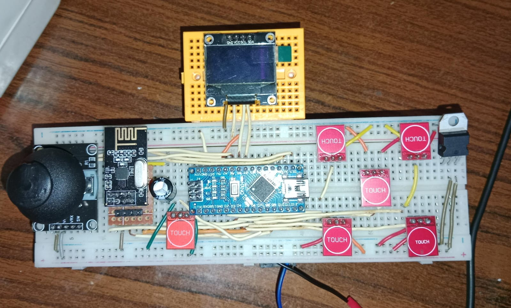
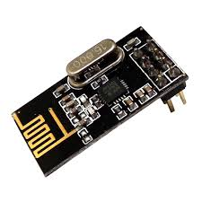
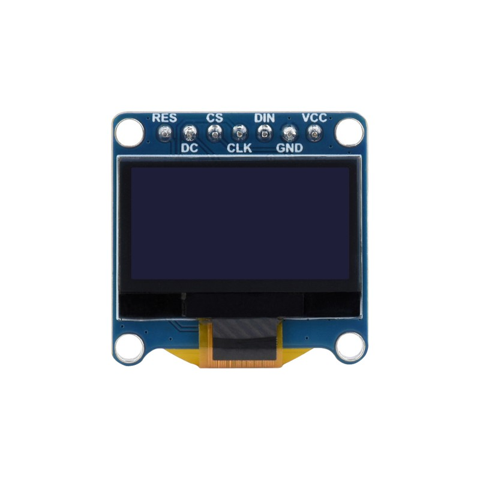
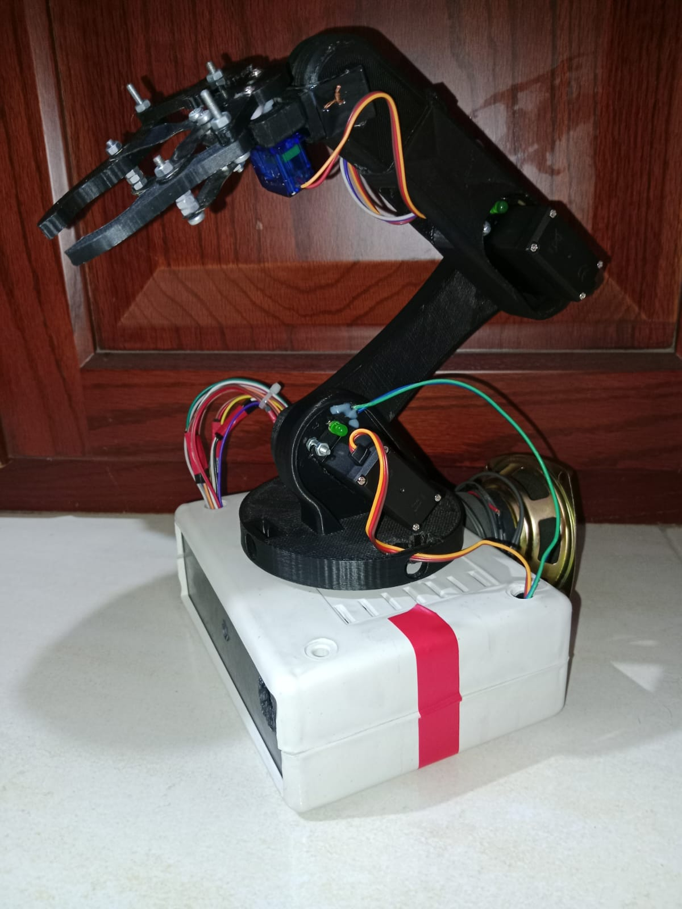
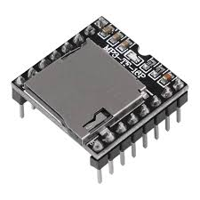

# 🏗️ System Architecture & Hardware Integration

The **Jarvis** robotic system operates on a dual-microcontroller architecture, communicating seamlessly via a low-latency 2.4GHz wireless link. The system is divided into two main units: **The Wireless Controller** and **The Robot Arm Base**.

---

## 🎮 1. The Wireless Controller (Master)
This is the command center used for manual overrides, game selection, and triggering specific animations.

*(Image: The custom-built wireless controller)*

### 🔌 Key Components:
* **Brain:** Arduino Nano.
* **Communication:** NRF24L01 Transceiver (Configured as Transmitter).
* **Interface:** * **OLED Display:** Provides real-time visual feedback on servo angles, selected game modes, and connection status.
  * **Input Modules:** 1x Analog Joystick for multi-axis movement, and **5x Capacitive Touch Sensors** for quick servo-switching and UI navigation.

  
  

---

## 🦾 2. The Robot Arm Base (Slave / Execution Unit)
This unit receives commands from either the PC (Python GUI) or the Wireless Controller and translates them into physical movements and audio feedback.

*(Image: Jarvis Robot Arm hardware setup)*

### 🔌 Key Components:
* **Brain:** Arduino Mega 2560 (Chosen for its multiple hardware serial ports and extensive I/O pins).
* **Communication:** NRF24L01 Transceiver (Configured as Receiver).
* **Actuation:** * 6x High-Torque Servo Motors for joint articulation.
  * L298 Motor Driver connected to DC motors, allowing the entire base to move dynamically.
* **Audio Feedback:** A serial MP3 Module synced with the Mega to play pre-recorded voice lines and sound effects during interactions.

  

---

## 🔄 High-Level Data Flow

Instead of a complex schematic, here is the functional flow of data within the system:

1. **AI / PC Mode:** `[Webcam / MediaPipe]  -->  [Python Desktop App]  --> (USB / PyFirmata2)  -->  [Arduino Mega]  -->  (Movement & Voice)`

2. **Manual / Remote Mode:**
   `[Touch Sensors & Joystick]  -->  [Arduino Nano]  --> (NRF24L01 Wireless)  -->  [Arduino Mega]  -->  (Movement & Voice)`
